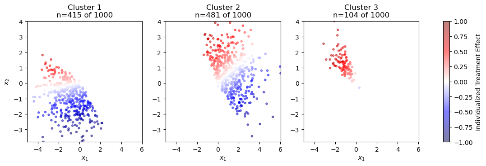
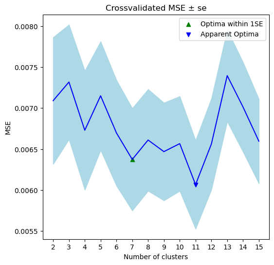

# clusterITE
[](https://github.com/fcgrolleau/clusterITE/blob/main/LICENSE)
[](https://www.Python.org) 



Equipped with a dataset of baseline covariates $`(X_i)_{1\leq i\leq n}`$ and predictions $(Y_i)_{1\leq i\leq n}$ from an estimated individualized treatment effect (ITE, aka CATE) function, the *clusterITE* library lets you estimate the function (i.e., gating network) mapping observations to their probabilities of belonging to clusters $1,\dots,K$ of similar (true) ITE function. The *clusterITE* library lets you conveniently pick $K$, the optimal number of cluster, via cross-validation. 

In essence, *clusterITE* uses an EM-algorithm to fit the non-parametric model:
$$\mathbb{E}[Y|X]=\sum_{k=1}^K \mathbb{P}(C_k=1|X) \mathbb{E}[Y|X, C_k=1]$$
where $C_1,\dots,C_K$ denote binary identifiers for the cluster $k=1,\dots,K$ an observation may belong to.

Our model and fitting algorithm are described in more details <a href="https://fcgrolleau.github.io/clusterITE/Mixture_of_ITEs.pdf">here</a>.

### Installation
```python
# download the library
import requests
url = 'https://raw.githubusercontent.com/fcgrolleau/clusterITE/main/clusterITE.py'
open('clusterITE.py', 'wb').write(requests.get(url).content)

# load it
from clusterITE import *
```

### 1. Specify a model architecture
```python
# For the gating network, define any Keras/Tensorflow architecture of your choice
def custom_tf_model(n_clusters):
    model = Sequential()
    ## Write your favorite architecture here...
    model.add(Dense(10, use_bias=True, activation='relu'))
    model.add(Dense(10, use_bias=True, activation='relu'))
    ## ... but make sure to finish the network like so
    model.add(Dense(n_clusters, use_bias=True, activation='softmax'))
    model.compile(loss='categorical_crossentropy', optimizer='rmsprop', metrics=['accuracy'])
    return model

# For the expert networks, define any sklearn architecture of your choice
# and store both expert and gating network in a dictonary
base_learners = {'experts': RandomForestRegressor(n_estimators=100, max_depth=10, max_features=10),
                 'gating_net': custom_tf_model}
```
### 2. Pick the optimal number of cluster $K$ via cross-validation
```python
# Instanciate a ClusterIte model with 5 fold cross-validation
cv_model = ClusterIte_cv(nb_folds=5, **base_learners)

# Specify a range for the no. of clusters and fit this model to the data
cv_model.fit(X,y, cluster_range = range(2,16))

# Plot the result
cv_model.plot()
```
 

### 3. Train a clusterITE model on all the data
```python
# Instanciate a ClusterIte model with the optimal K estimated from cross-validation
final_model = ClusterIte(K=cv_model.best_K, **base_learners)

# Fit this model on all the training data
final_model.fit(X, y)
```

### 4. Use your fitted model for cluster prediction and evaluation on unseen data
```python
# Use the gating network of your trained model to predict the probabilities 
# of belonging to clusters 1,...,K for unseen observations
final_model.gate_predict(X_test)

# Evaluate the MSE of the final model on unseen data
mean_squared_error(final_model.predict(X_test), y_test)
````

See implementation details in <a href="https://nbviewer.org/github/fcgrolleau/clusterITE/blob/main/minimal.ipynb">minimal.ipynb</a>.

See more details and a toy simulation in <a href="https://nbviewer.org/github/fcgrolleau/clusterITE/blob/main/clusterITE.ipynb">clusterITE.ipynb</a>.
